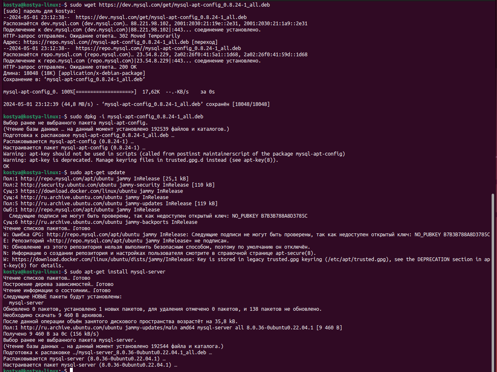
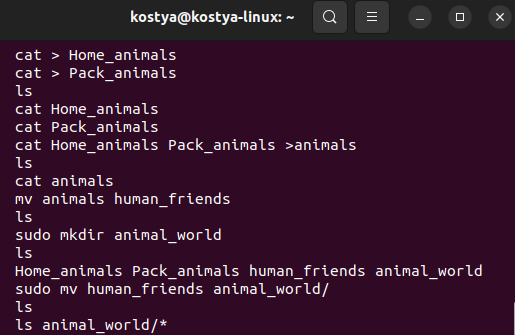
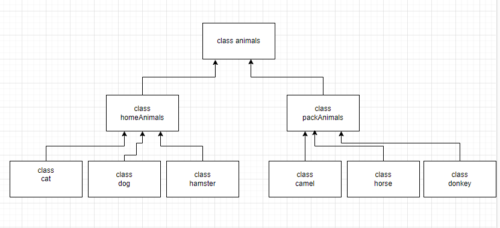

### Задание 1
 Используя команду cat в терминале операционной системы Linux, создать
два файла Домашние животные (заполнив файл собаками, кошками,
хомяками) и Вьючные животными заполнив файл Лошадьми, верблюдами и
ослы, а затем объединить их. Просмотреть содержимое созданного файла.
Переименовать файл, дав ему новое имя (Друзья человека).

### Задание 2
Создать директорию, переместить файл туда.

### Задание 3
Подключить дополнительный репозиторий MySQL. Установить любой пакет из этого репозитория.

### Задание 4
Установить и удалить deb-пакет с помощью dpkg.

sudo wget https://download.docker.com/linux/ubuntu/dists/jammy/pool/stable/amd64/docker-ce-cli_20.10.13~3-0~ubuntu-jammy_amd64.deb

sudo dpkg -i docker-ce-cli_20.10.133-0ubuntu-jammy_amd64.deb

sudo dpkg -r docker-ce-cli

### Задание 5
Выложить историю команд в терминале ubuntu

### Задание 6
Нарисовать диаграмму, в которой есть класс родительский класс, домашние животные и вьючные животные, в составы которых в случае домашних животных войдут классы: собаки, кошки, хомяки, а в класс вьючные животные войдут: Лошади, верблюды и ослы.

### Задание 7
В подключенном MySQL репозитории создать базу данных “Друзья человека”

CREATE DATABASE Human_friends;

### Задание 8
Создать таблицы с иерархией из диаграммы в БД.

USE Human_friends;
CREATE TABLE animal_classes

(

	Id INT AUTO_INCREMENT PRIMARY KEY, 

	Class_name VARCHAR(20)

);

INSERT INTO animal_classes (Class_name)

VALUES ('вьючные'),

('домашние');  

CREATE TABLE packed_animals

(

	  Id INT AUTO_INCREMENT PRIMARY KEY,
    Genus_name VARCHAR (20),

    Class_id INT,

    FOREIGN KEY (Class_id) REFERENCES animal_classes (Id) ON DELETE CASCADE 
    ON UPDATE CASCADE

);

INSERT INTO packed_animals (Genus_name, Class_id)

VALUES ('Лошади', 1),

('Ослы', 1),  

('Верблюды', 1); 
    
CREATE TABLE home_animals
(
	  Id INT AUTO_INCREMENT PRIMARY KEY,

    Genus_name VARCHAR (20),

    Class_id INT,
    FOREIGN KEY (Class_id) REFERENCES animal_classes (Id) ON DELETE CASCADE ON UPDATE CASCADE

);

INSERT INTO home_animals (Genus_name, Class_id)
VALUES ('Кошки', 2),

('Собаки', 2),  

('Хомяки', 2); 

CREATE TABLE cats 
(       

    Id INT AUTO_INCREMENT PRIMARY KEY, 
    Name VARCHAR(20), 
    Birthday DATE,
    Commands VARCHAR(50),
    Genus_id int,
    Foreign KEY (Genus_id) REFERENCES home_animals (Id) ON DELETE CASCADE ON UPDATE CASCADE

);

### Задание 9
Заполнить низкоуровневые таблицы именами(животных), командами которые они выполняют и датами рождения.

INSERT INTO cats (Name, Birthday, Commands, Genus_id)

VALUES ('Рыцарь', '2020-10-12', 'кс', 1),

('Варвар', '2018-05-01', "назад!", 1),  

('Маг', '2019-04-10', "", 1); 

CREATE TABLE dogs 
(       

    Id INT AUTO_INCREMENT PRIMARY KEY, 
    Name VARCHAR(20), 
    Birthday DATE,
    Commands VARCHAR(50),
    Genus_id int,
    Foreign KEY (Genus_id) REFERENCES home_animals (Id) ON DELETE CASCADE ON UPDATE CASCADE
);

INSERT INTO dogs (Name, Birthday, Commands, Genus_id)

VALUES ('Стрелок', '2019-04-10', 'ко мне, лежать, лапу, голос', 2),

('Командир', '2015-07-12', "сидеть, лежать, лапу", 2),  

('Волк', '2013-03-11', "сидеть, лежать, лапу, след, фас", 2), 

('Барбос', '2020-11-10', "сидеть, лежать, фу, место", 2);

CREATE TABLE hamsters 
(       

    Id INT AUTO_INCREMENT PRIMARY KEY, 
    Name VARCHAR(20), 
    Birthday DATE,
    Commands VARCHAR(50),
    Genus_id int,
    Foreign KEY (Genus_id) REFERENCES home_animals (Id) ON DELETE CASCADE ON UPDATE CASCADE
);

INSERT INTO hamsters (Name, Birthday, Commands, Genus_id)

VALUES ('Овервоч', '2021-03-12', 'в шар', 3),

('Овервоч2', '2022-01-01', "ульта", 3),  

('Макри', '2021-05-01', NULL, 3), 

('Гендзи', '2021-03-03', NULL, 3);

CREATE TABLE horses 
(       

    Id INT AUTO_INCREMENT PRIMARY KEY, 
    Name VARCHAR(20), 
    Birthday DATE,
    Commands VARCHAR(50),
    Genus_id int,
    Foreign KEY (Genus_id) REFERENCES packed_animals (Id) ON DELETE CASCADE ON UPDATE CASCADE
);

INSERT INTO horses (Name, Birthday, Commands, Genus_id)

VALUES ('Зельда', '2019-03-13', 'бегом, шагом', 1),

('Линк', '2014-05-16', "бегом, шагом, хоп", 1),  

('Гарон', '2011-02-13', "бегом, шагом, хоп, брр", 1), 

('Трифорс', '2021-10-15', "бегом, шагом, хоп", 1);

CREATE TABLE donkeys 
(       

    Id INT AUTO_INCREMENT PRIMARY KEY, 
    Name VARCHAR(20), 
    Birthday DATE,
    Commands VARCHAR(50),
    Genus_id int,
    Foreign KEY (Genus_id) REFERENCES packed_animals (Id) ON DELETE CASCADE ON UPDATE CASCADE
);

INSERT INTO donkeys (Name, Birthday, Commands, Genus_id)

VALUES ('рисковый', '2010-03-11', NULL, 2),

('бывалый', '2021-04-11', "", 2),  

('понимающий', '2020-05-17', "", 2), 

('не понимающий', '2021-11-11', NULL, 2);

CREATE TABLE camels 
(   

    Id INT AUTO_INCREMENT PRIMARY KEY, 

    Name VARCHAR(20), 
    Birthday DATE,
    Commands VARCHAR(50),
    Genus_id int,
    Foreign KEY (Genus_id) REFERENCES packed_animals (Id) ON DELETE CASCADE ON UPDATE CASCADE
);

INSERT INTO camels (Name, Birthday, Commands, Genus_id)

VALUES ('Вода', '2021-05-11', 'туда', 3),

('Земля', '2015-06-11', "сюда", 3),  

('Воздух', '2014-06-22', "обратно", 3), 

('Огонь', '2021-11-16', "молодец", 3);

